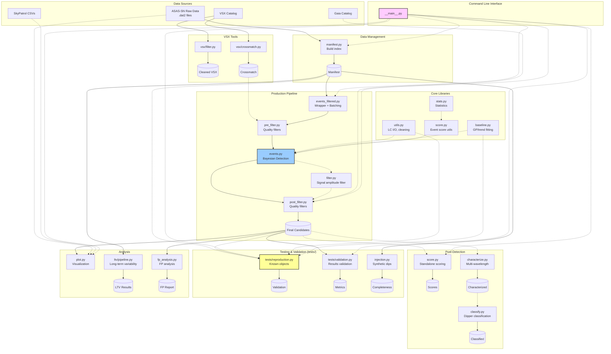

# MALCA: Multi-timescale ASAS-SN Light Curve Analysis


#### What files are expected
- Per-mag-bin directories: `/data/poohbah/1/assassin/rowan.90/lcsv2/<mag_bin>/`
  - Index CSVs: `index*.csv` with columns like `asas_sn_id, ra_deg, dec_deg, pm_ra, pm_dec, ...`
- Light curves: `lc<num>_cal/` folders containing `<asas_sn_id>.dat2`
- Optional catalogs:
  - VSX crossmatch: `input/vsx/asassn_x_vsx_matches_20250919_2252.csv` (pre-crossmatched with columns: asas_sn_id, sep_arcsec, class)
  - Raw VSX: `input/vsx/vsxcat.090525.csv` (used by `vsx/filter.py` to generate crossmatch)
  - Note: Bright nearby star (BNS) filtering is handled upstream by ASAS-SN during LC generation

#### Dependencies
- Core pipeline: numpy, pandas, scipy, numba, astropy, celerite2, matplotlib, tqdm
- Optional outputs: pyarrow (parquet), duckdb
- Optional visualization: plotly (3D injection plots)
- Multi-wavelength characterization: astroquery (Gaia queries), dustmaps3d (3D dust extinction), pyvo (StarHorse TAP queries), banyan-sigma (young associations), requests (unWISE queries)
- Notebooks/EDA: jupyterlab, ipykernel, seaborn, scikit-learn, joblib

## Quick Start
```bash
# Build manifest (source_id → path index)
python -m malca manifest --index-root /path/to/lcsv2 --lc-root /path/to/lcsv2 \
    --mag-bin 13_13.5 --out output/manifest.parquet --workers 10

# Run event detection pipeline
python -m malca detect --mag-bin 13_13.5 --workers 10 \
    --lc-root /path/to/lcsv2 --index-root /path/to/lcsv2 \
    -- --output output/results.csv --workers 10 --min-mag-offset 0.1

# Validate results against known candidates (no raw data needed)
python -m malca validation --results output/results.csv

# Plot light curves
python -m malca plot --input /path/to/lc123.dat2 --out-dir output/plots

# Score detected events
python -m malca score --events output/results.csv --output output/scores.csv

# Apply quality filters
python -m malca filter --input output/results.csv --output output/filtered.csv

# Multi-wavelength characterization (post-detection)
python -m malca.characterize --input output/filtered.csv --output output/characterized.csv --dust --starhorse input/starhorse/starhorse.parquet

# Get help for any command
python -m malca --help
python -m malca detect --help
```

#### More example variations
```bash
# Detect on a single mag bin with logBF triggering (faster)
python -m malca detect --mag-bin 13_13.5 --workers 8 \
    --lc-root /path/to/lcsv2 --index-root /path/to/lcsv2 \
    -- --output output/events_logbf.csv --trigger-mode logbf --baseline-func trend --min-mag-offset 0.1

# Detect on multiple mag bins (writes one output per bin)
python -m malca detect --mag-bin 12_12.5 12.5_13 13_13.5 \
    --lc-root /path/to/lcsv2 --index-root /path/to/lcsv2 \
    -- --output output/lc_events_results.csv --trigger-mode logbf

# Reproduce on built-in candidates using local SkyPatrol CSVs
python -m malca validate --candidates brayden_candidates --skypatrol-dir input/skypatrol2 \
    --method bayes --trigger-mode logbf --workers 4

# Reproduce using events.py output directly (uses the 'path' column)
python -m malca validate --input output/events_logbf.csv --method bayes --trigger-mode logbf

# Injection-recovery quick test (small run)
python -m malca.injection --manifest output/lc_manifest_all.parquet \
    --control-sample-size 2000 --max-trials 2000 --workers 4 --overwrite
```

#### Typical run (large batches)
1) Build a manifest (map IDs -> light-curve directories):
   ```bash
   python malca/manifest.py --index-root /data/poohbah/1/assassin/rowan.90/lcsv2 --lc-root /data/poohbah/1/assassin/rowan.90/lcsv2 --mag-bin 13_13.5 --out /home/lenhart.106/code/malca/output/lc_manifest_13_13.5.parquet --workers 10
   ```
2) Pre-filter and run events in batches with resume support:
   ```bash
   python -m malca.events_filtered --mag-bin 13_13.5 --workers 10 \
       --min-time-span 100 --min-points-per-day 0.05 --min-cameras 2 \
       --vsx-crossmatch input/vsx/asassn_x_vsx_matches_20250919_2252.csv \
       --batch-size 2000 \
       --lc-root /data/poohbah/1/assassin/rowan.90/lcsv2 \
       --index-root /data/poohbah/1/assassin/rowan.90/lcsv2 \
       --output /home/lenhart.106/code/malca/output/lc_events_results_13_13.5.csv \
       --trigger-mode posterior_prob --baseline-func gp --min-mag-offset 0.1
   ```
   - The wrapper builds/loads the manifest, runs pre-filters from `malca/pre_filter.py`, then calls `malca/events.py` in batches.
   - Pre-filters: sparse LC removal, multi-camera requirement, VSX filtering (tags retained on survivors)
   - Resume: if interrupted, it skips already processed paths using the `*_PROCESSED.txt` checkpoint next to the output.
   - VSX tags are saved to `prefilter/vsx_tags/vsx_tags_<magbin>.csv` and merged into events results.
   - To disable VSX handling: add `--skip-vsx`
   - To tag instead of filter: add `--vsx-mode tag`
   - All events.py arguments (trigger-mode, baseline-func, thresholds, etc.) are passed directly to events_filtered.py

3) Post-filter events (strict quality cuts on candidates only):
   ```bash
   python -m malca.post_filter --input /home/lenhart.106/code/malca/output/lc_events_results_13_13.5.csv --output /home/lenhart.106/code/malca/output/lc_events_results_13_13.5_filtered.csv

   # With custom thresholds
   python -m malca.post_filter --input results.csv --output filtered.csv --min-bayes-factor 20 --min-event-prob 0.7 --apply-morphology
   ```
   - **Implemented filters**: posterior strength (Bayes factors), event probability, run robustness, morphology
   - **Placeholder filters** (not yet implemented): periodicity (LSP), Gaia RUWE, periodic catalog crossmatch

## Pipeline Architecture



**Key Components:**
- **Production**: `manifest.py` → `pre_filter.py` → `events.py` → `post_filter.py`
- **Testing**: `tests/reproduction.py` (re-runs detection), `tests/validation.py` (validates results), `injection.py` (synthetic dips)
- **CLI**: Unified interface via `python -m malca [command]`

See [docs/architecture.md](docs/architecture.md) for detailed documentation.

## Output Directory Structure

### Integrated Pipeline (`--detect-run`)

When running the full detection pipeline with `--detect-run`, the following directory structure is created for complete provenance tracking:

```
output/runs/20250121_143052/          # Timestamp-based run directory
├── run_params.json                   # Detection parameters (events_filtered.py)
├── run_summary.json                 # Detection results stats (events_filtered.py)
├── filter_log.json                   # Filtering parameters & stats (post_filter.py)
├── score_log.json                    # Scoring parameters & stats (score.py)
├── plot_log.json                     # Plotting parameters (plot.py)
├── run.log                           # Simple text log with paths
│
├── manifests/                        # Manifest files
│   └── lc_manifest_{mag_bin}.parquet
│
├── prefilter/                        # Pre-filtering results
│   ├── lc_filtered_{mag_bin}.parquet
│   ├── lc_stats_checkpoint_{mag_bin}.parquet
│   ├── rejected_pre_filter_{mag_bin}.csv
│   └── vsx_tags/
│       └── vsx_tags_{mag_bin}.csv
│
├── paths/                            # Input paths
│   └── filtered_paths_{mag_bin}.txt
│
├── results/                          # Detection results
│   ├── lc_events_results.csv         # Raw detection output
│   ├── lc_events_results_PROCESSED.txt  # Checkpoint log
│   ├── lc_events_results_filtered.csv   # After post_filter.py
│   └── rejected_post_filter.csv      # Post-filter rejections
│
├── scores/                           # Scoring results (score.py)
│   └── dipper_scores.csv             # or microlens_scores.csv
│
└── plots/                            # Visualizations (plot.py)
    ├── {source_id}_dips.png
    ├── {source_id}_dips.png
    └── ...
```

**Key Features:**
- **JSON logs track full provenance**: Every parameter and result is logged for reproducibility
- **Self-contained runs**: Each timestamped directory contains everything needed to reproduce the analysis
- **Checkpoint support**: Detection runs can be interrupted and resumed using `*_PROCESSED.txt` files
- **Rejection tracking**: Both pre-filter and post-filter rejections are logged with reasons

**JSON Log Contents:**
- `run_params.json`: All pre-filter and detection parameters (thresholds, workers, baseline settings)
- `run_summary.json`: Manifest statistics, pre-filter rejection breakdown, detection results
- `filter_log.json`: Filter toggles, thresholds, input/output counts, rejection breakdown
- `score_log.json`: Scoring parameters, score distribution statistics
- `plot_log.json`: Plotting parameters, GP settings, number of plots generated

### Standalone Module Outputs

#### Injection Testing (`python -m malca.injection`)

```
output/injection/                     # Default output directory
├── results/
│   ├── injection_results.csv         # Trial-by-trial injection results
│   └── injection_results_PROCESSED.txt  # Checkpoint for resume
│
├── cubes/
│   └── efficiency_cube.npz           # 3D efficiency cube (depth × duration × mag)
│
└── plots/
    ├── mag_slices/                   # Per-magnitude 2D heatmaps
    │   ├── mag_12.0_efficiency.png
    │   ├── mag_13.0_efficiency.png
    │   └── ...
    ├── efficiency_marginalized_*.png  # Averaged over one axis
    ├── depth_at_*pct_efficiency.png   # Threshold contour maps
    └── efficiency_3d_volume.html      # Interactive 3D (if plotly installed)
```

#### Detection Rate (`python -m malca.detection_rate`)

```
output/detection_rate/                # Default base directory
├── 20250121_143052/                  # Timestamped run directory
│   ├── run_params.json                # Full parameter dump
│   ├── results/
│   │   ├── detection_rate_results.csv
│   │   ├── detection_rate_results_PROCESSED.txt  # Checkpoint
│   │   └── detection_summary.json     # Detection rate summary
│   └── plots/
│       ├── detection_rate_vs_mag.png
│       ├── detection_duration_dist.png
│       └── detection_depth_dist.png
│
├── 20250121_150318_custom_tag/       # Optional --run-tag appended
│   └── ...
│
└── latest -> 20250121_150318_custom_tag/  # Symlink to latest run
```

#### Multi-Wavelength Characterization (`python -m malca.characterize`)

```
output/
├── characterized.csv                 # Single output file with added columns:
                                      #   - Gaia astrometry & photometry
                                      #   - 3D dust extinction (A_v_3d, ebv_3d)
                                      #   - YSO classification (yso_class)
                                      #   - Galactic population (thin_disk/thick_disk)
                                      #   - StarHorse ages/masses (if provided)
                                      #   - Auxiliary crossmatches (BANYAN Σ, IPHAS, etc.)
└── gaia_cache/                       # Gaia query cache (optional)
    └── gaia_results_{hash}.parquet
```

#### Dipper Classification (`python -m malca.classify`)

```
output/
└── classified.csv                    # Single output file with added columns:
                                      #   - P_eb, P_cv, P_starspot, P_disk
                                      #   - yso_class
                                      #   - a_circ_au, transit_prob
                                      #   - final_class (EB/CV/Starspot/Disk/YSO/Unknown)
```

#### Manifest Building (`python -m malca.manifest`)

```
output/
└── lc_manifest_{mag_bin}.parquet     # Single parquet file with:
                                      #   - asas_sn_id
                                      #   - ra_deg, dec_deg
                                      #   - lc_dir (directory path)
                                      #   - dat_path (full .dat2 path)
                                      #   - dat_exists (bool)
```

---

### Running pieces manually
- Build manifest only:
  `python malca/manifest.py --index-root <index_dir> --lc-root <lc_dir> --mag-bin 12_12.5 --out /home/lenhart.106/code/malca/output/lc_manifest.parquet`
- Pre-filter only (expects columns `asas_sn_id` and `path` pointing to lc_dir):
  `python -m malca.pre_filter --help`
- Events only:
  ```bash
  python -m malca.events --input /path/to/lc*_cal/*.dat2 --output output/results.parquet --workers 10
  
  # With signal amplitude filtering (requires |event_mag - baseline_mag| > 0.1)
  python -m malca.events --input /path/to/lc*_cal/*.dat2 --output output/results.parquet --workers 10 --min-mag-offset 0.1
  ```
  - Default Bayesian grid is 12x12 (12 p-grid points × 12 mag-grid points). Change p-grid with `--p-points`.
  - Signal amplitude filter (default: 0.1 mag) ensures detected events have sufficient deviation from baseline.
- Post-filter only:
  `python -m malca.post_filter --input /home/lenhart.106/code/malca/output/results.parquet --output /home/lenhart.106/code/malca/output/results_filtered.parquet`
  - VSX handling in pre-filter:
    - Default is filter: drops VSX matches, but keeps `sep_arcsec` and `class` on survivors.
    - Use `--vsx-mode tag` (with `--skip-vsx` off) to keep all matches and only tag.
    - When using `events_filtered.py`, tags are also merged into events results and saved to `prefilter/vsx_tags/vsx_tags_<magbin>.csv`.
- Targeted reproduction of specific candidates (Bayesian only):
  ```bash
  # Re-run detection on raw data (requires manifest and .dat2 files)
  python -m tests.reproduction --method bayes --manifest output/lc_manifest.parquet \
      --candidates my_targets.csv --out-dir output/results_repro --workers 10
  ```
  **Note**: Only `--method bayes` is supported. Legacy methods `naive` and `biweight` have been deprecated.
  
- Validate results without raw data:
  ```bash
  # Auto-discover and validate ALL results for LOO method
  python -m tests.validation --method loo
  
  # Auto-discover for Bayes Factor method
  python -m tests.validation --method bf
  
  # Filter to specific magnitude bin
  python -m tests.validation --method loo --mag-bin 13_13.5
  
  # Direct file specification (original behavior)
  python -m tests.validation --results output/results.csv

  # Validate latest detect run output (output/runs/<timestamp>/results)
  python -m tests.validation --latest-run

  # Validate a specific detect run directory
  python -m tests.validation --run-dir output/runs/20250119_1349
  
  # With custom candidates
  python -m tests.validation --method loo --candidates my_targets.csv -v
  ```
- Plot light curves with baseline/residuals:
  ```bash
  # Single file
  python -m malca.plot --input /path/to/lc123.dat2 --out-dir /home/lenhart.106/code/malca/output/plots --format png

  # Multiple files (glob patterns supported)
  python -m malca.plot --input input/skypatrol2/*.csv --out-dir /home/lenhart.106/code/malca/output/plots --skip-events

  # All files from events.py results
  python -m malca.plot --events /home/lenhart.106/code/malca/output/lc_events_results_13_13.5_filtered.csv --out-dir /home/lenhart.106/code/malca/output/plots
  ```
- Batch plot Bayesian results (SkyPatrol CSVs, filtered by events output):
  `python -m malca.plot_results_bayes /path/to/*-light-curves.csv --results-csv /home/lenhart.106/code/malca/output/lc_events_results_13_13.5.csv --out-dir /home/lenhart.106/code/malca/output/plots`
- Event scoring (dips or microlensing):
  ```bash
  # Score dip events (default)
  python -m malca.score --events /home/lenhart.106/code/malca/output/lc_events_results_13_13.5.csv --output /home/lenhart.106/code/malca/output/dipper_scores.csv --event-type dip

  # Score microlensing events (Paczyński curves)
  python -m malca.score --events /home/lenhart.106/code/malca/output/lc_events_results_13_13.5.csv --output /home/lenhart.106/code/malca/output/microlens_scores.csv --event-type microlensing
  ```
- Injection-recovery testing (validate pipeline completeness/contamination):
  ```bash
  # Full run: uses default manifest (output/lc_manifest_all.parquet)
  python -m malca.injection --workers 10

  # Quick test with limited trials
  python -m malca.injection --max-trials 1000 --workers 10

  # Custom manifest and output directory
  python -m malca.injection --manifest /path/to/manifest.parquet --out-dir /custom/output/injection
  ```
  Output structure (default `output/injection/`):
  ```
  output/injection/
    results/
      injection_results.csv           # Trial-by-trial results
      injection_results_PROCESSED.txt # Checkpoint for resume
    cubes/
      efficiency_cube.npz             # 3D efficiency cube
    plots/
      mag_slices/                     # Per-magnitude 2D heatmaps
      efficiency_marginalized_*.png   # Averaged over one axis
      depth_at_*pct_efficiency.png    # Threshold contour maps
      efficiency_3d_volume.html       # Interactive 3D (if plotly installed)
  ```
  Python API:
  ```python
  from malca.injection import (
      load_efficiency_cube,
      plot_efficiency_all,
      plot_efficiency_mag_slices,
      plot_efficiency_marginalized,
      plot_efficiency_threshold_contour,
      plot_efficiency_3d,
  )

  # Load and visualize existing cube
  cube = load_efficiency_cube("output/injection/cubes/efficiency_cube.npz")
  plot_efficiency_marginalized(cube, axis="mag", output_path="avg_over_mag.png")
  plot_efficiency_threshold_contour(cube, threshold=0.5, output_path="depth_at_50pct.png")
  ```
  - Injects synthetic dips with skew-normal profiles onto real observed light curves
  - Preserves real cadence, systematics, and noise characteristics
  - Produces comprehensive efficiency metrics and visualizations
  - Supports resume for long-running parameter sweeps

### Multi-Wavelength Characterization

After detecting dipper candidates, characterize them using multi-wavelength data:

```bash
# Full characterization with Gaia, dust extinction, and YSO classification
python -m malca.characterize \
  --input output/filtered.csv \
  --output output/characterized.csv \
  --dust \
  --starhorse input/starhorse/starhorse2021.parquet
```

**Features:**
- **Gaia DR3 Queries**: Astrometry, astrophysics (Teff, logg, metallicity, distance), 2MASS/AllWISE photometry
- **3D Dust Extinction**: All-sky coverage via `dustmaps3d` (Wang et al. 2025, ~350MB)
- **YSO Classification**: Koenig & Leisawitz (2014) IR color-color diagram with dust correction
- **Galactic Population**: Thin/thick disk classification using metallicity or StarHorse ages
- **StarHorse** (optional): Stellar ages, masses, distances from local catalog join
- **Auxiliary Catalog Crossmatches** (Tzanidakis+2025):
  - BANYAN Σ: Young stellar association membership probabilities
  - IPHAS DR2: Hα emission detection for Galactic plane sources
  - Star-forming regions: Proximity check to known SFRs (Prisinzano+2022)
  - Open clusters: Cantat-Gaudin+2020 membership crossmatch
  - unWISE/unTimely: Mid-IR variability z-scores
- **Color Evolution Analysis**: (g-r) color differences and CMD slope fitting
- **Caching**: Gaia results cached locally to speed up repeated analyses

**Setup:**
```bash
# Install multiwavelength dependencies
pip install -e ".[multiwavelength]"

# Dust maps auto-download on first use (~350MB)
# For StarHorse, download catalog manually:
# https://cdsarc.cds.unistra.fr/viz-bin/cat/I/354
```

**Output columns:**
- `source_id`, `ra`, `dec`, `parallax`, `distance_gspphot`
- `tmass_j`, `tmass_h`, `tmass_k`, `unwise_w1`, `unwise_w2`
- `A_v_3d`, `ebv_3d` (3D dust extinction)
- `H_K`, `W1_W2`, `yso_class` (Class I/II/Transition Disk/Main Sequence)
- `population` (thin_disk/thick_disk from metallicity or age)
- `age50`, `mass50` (if StarHorse provided)
- Auxiliary crossmatches (Tzanidakis+2025):
  - `banyan_field_prob`, `banyan_best_assoc` (BANYAN Σ membership)
  - `iphas_r_ha`, `iphas_ha_excess` (IPHAS Hα)
  - `near_sfr`, `sfr_name` (star-forming region proximity)
  - `cluster_name`, `cluster_age_myr` (open cluster membership)
  - `unwise_w1_zscore`, `unwise_w1_var` (IR variability)
- Color evolution (if multi-band available):
  - `color_baseline`, `color_dip`, `color_diff`, `is_redder`
  - `cmd_slope`, `cmd_slope_angle`, `cmd_ism_consistent`


  - Measures completeness as function of dip depth, duration, and stellar magnitude
  - 3D efficiency cube for completeness corrections in occurrence rate calculations
- Seasonal trend summary (LTVar-style):
  `python -m malca.ltv.core --mag-bin 13_13.5 --output /home/lenhart.106/code/malca/output/ltv_13_13.5.csv --workers 10`
- Quick stats for a single LC file:
  `python -m malca.stats /path/to/lc123.dat2`
- False-positive reduction summary (pre vs post filter):
  `python -m malca.fp_analysis --pre /home/lenhart.106/code/malca/output/pre.csv --post /home/lenhart.106/code/malca/output/post.csv`

### CLI modules
- `malca.manifest`: `python -m malca.manifest --index-root /data/poohbah/1/assassin/rowan.90/lcsv2 --lc-root /data/poohbah/1/assassin/rowan.90/lcsv2 --mag-bin 13_13.5 --out /home/lenhart.106/code/malca/output/lc_manifest_13_13.5.parquet --workers 10`
- `malca.events_filtered`: `python -m malca.events_filtered --mag-bin 13_13.5 --workers 10 --min-time-span 100 --min-points-per-day 0.05 --min-cameras 2 --vsx-crossmatch input/vsx/asassn_x_vsx_matches_20250919_2252.csv --batch-size 2000 --lc-root /data/poohbah/1/assassin/rowan.90/lcsv2 --index-root /data/poohbah/1/assassin/rowan.90/lcsv2 --output /home/lenhart.106/code/malca/output/lc_events_results_13_13.5.csv --trigger-mode posterior_prob --baseline-func gp`
- `malca.events`: `python -m malca.events --input /path/to/lc*_cal/*.dat2 --output /home/lenhart.106/code/malca/output/results.csv --workers 10`
- `malca.post_filter`: `python -m malca.post_filter --input /home/lenhart.106/code/malca/output/results.csv --output /home/lenhart.106/code/malca/output/results_filtered.csv`
- `malca.plot`: `python -m malca.plot --input /path/to/lc123.dat2 --out-dir /home/lenhart.106/code/malca/output/plots --format png`
- `malca.score`: `python -m malca.score --events /home/lenhart.106/code/malca/output/results.csv --output /home/lenhart.106/code/malca/output/dipper_scores.csv --event-type dip`
- `malca.injection`: `python -m malca.injection --workers 10` (uses `output/lc_manifest_all.parquet`, outputs to `output/injection/`)
- `malca.ltv.core`: `python -m malca.ltv.core --mag-bin 13_13.5 --output /home/lenhart.106/code/malca/output/ltv_13_13.5.csv --workers 10`
- `malca.stats`: `python -m malca.stats /path/to/lc123.dat2`
- `malca.fp_analysis`: `python -m malca.fp_analysis --pre /home/lenhart.106/code/malca/output/pre.csv --post /home/lenhart.106/code/malca/output/post.csv`
- **Testing modules** (in `tests/` directory):
  - `tests.reproduction`: `python -m tests.reproduction --method bayes --manifest output/lc_manifest.parquet --candidates targets.csv --out-dir output/results_repro`
  - `tests.validation`: `python -m tests.validation --method {loo,bf} [--mag-bin 13_13.5] [--all-mag-bins]` (auto-discovers results in `output/{loo,logbf}_events_results/`)
- **VSX tools** (now in `malca.vsx` subpackage):
  - `malca.vsx.filter`: `python -m malca.vsx.filter`
  - `malca.vsx.crossmatch`: `python -m malca.vsx.crossmatch`
  - `malca.vsx.reproducibility`: `python -m malca.vsx.reproducibility`

#### Legacy/old scripts
- `malca.old.plot_results_bayes`: `python -m malca.old.plot_results_bayes /path/to/*-light-curves.csv --results-csv /home/lenhart.106/code/malca/output/results.csv --out-dir /home/lenhart.106/code/malca/output/plots`
- `malca.old.plot_results`: `python -m malca.old.plot_results /home/lenhart.106/code/malca/output/peaks.csv --csv-dir input/skypatrol2 --out-dir /home/lenhart.106/code/malca/output/plots`
- `malca.old.lc_events`: `python -m malca.old.lc_events --mode dips --mag-bin 13_13.5 --out-dir /home/lenhart.106/code/malca/output/lc_events_old --format csv --workers 10`
- `malca.old.lc_filter`: `python -m malca.old.lc_filter /home/lenhart.106/code/malca/output/peaks.csv --output /home/lenhart.106/code/malca/output/peaks_filtered.csv`
- `malca.old.falsepositives`: `python -m malca.old.falsepositives --pre /home/lenhart.106/code/malca/output/pre.csv --post /home/lenhart.106/code/malca/output/post.csv`
- `malca.old.stats`: `python -m malca.old.stats /path/to/lc123.dat2`
- `malca.old.test_skypatrol`: `python -m malca.old.test_skypatrol input/skypatrol2/*.csv --out /home/lenhart.106/code/malca/output/test_results.csv`

### Notes
- Always generate the manifest first; everything else depends on knowing where each `<asas_sn_id>.dat2` lives.
- VSX filtering is enabled by default in `events_filtered.py` - uses pre-crossmatched file `input/vsx/asassn_x_vsx_matches_20250919_2252.csv`
  - To disable VSX handling: add `--skip-vsx` flag
  - To tag instead of filter: add `--vsx-mode tag`
  - Tags are stored in `prefilter/vsx_tags/vsx_tags_<magbin>.csv` and merged into events results (even when filtering).
  - To use a different crossmatch file: `--vsx-crossmatch /path/to/crossmatch.csv`
  - Crossmatch file must have columns: `asas_sn_id`, `sep_arcsec`, `class`
- Bright nearby star (BNS) filtering is NOT needed - ASAS-SN already filtered this during LC generation
- Pre-filters (run on all sources before event detection):
  - Sparse LC removal: reject LCs with insufficient time span or cadence
  - Multi-camera requirement: require observations from ≥2 cameras
  - VSX crossmatch: reject known variables within 3 arcsec
- Post-filters (run on detected candidates only):
  - Periodicity validation: bootstrap Lomb-Scargle periodogram with significance testing
  - Gaia RUWE check: flag potential binary contamination (RUWE > 1.4)
  - Periodic catalog crossmatch: check against known periodic variable catalogs


### Dependencies
- **Required**: numpy, pandas, scipy, numba, astropy, tqdm, matplotlib, celerite2, pyarrow
- **Optional**:
  - `plotly` - Interactive 3D efficiency plots in injection testing
  - `duckdb` - Alternative output format (use `--output-format duckdb`)
  - `joblib`, `seaborn`, `scikit-learn` - Notebook analysis and profiling
