# MALCA Pipeline Architecture

Complete architecture showing all modules and their relationships.

## Full System Architecture

```mermaid
graph TB
      subgraph "Data Sources"
          RAW[ASAS-SN Raw Data<br/>.dat2 files]
          SKY[SkyPatrol CSVs]
          VSX_CAT[VSX Catalog<br/>vsxcat.csv]
          GAIA[Gaia Catalog<br/>Optional]
          PERIODIC[Periodic Catalogs<br/>Optional]
      end

      subgraph "Core Libraries"
          UTILS[utils.py<br/>LC I/O, cleaning]
          BASE[baseline.py<br/>GP/trend fitting]
          STATS_LIB[stats.py<br/>LC statistics]
          SCORE_LIB[score.py<br/>Event score utils]
      end

      subgraph "Data Management"
          MAN[manifest.py<br/>Build source_id -> path index]
          RAW --> MAN
          MAN --> MAN_OUT[(Manifest<br/>Parquet)]
      end

      subgraph "VSX Subpackage"
          VSX_FILT[vsx/filter.py<br/>Clean VSX classes]
          VSX_CROSS[vsx/crossmatch.py<br/>ASASSN <-> VSX matching]
          VSX_REPRO[vsx/reproducibility.py<br/>VSX object recovery]
          VSX_CAT --> VSX_FILT
          VSX_CAT --> VSX_CROSS
          VSX_FILT --> VSX_CLEAN[(Cleaned VSX)]
          VSX_CROSS --> VSX_MATCH[(Crossmatch CSV)]
      end

      subgraph "Production Pipeline"
          EV_FILT[events_filtered.py<br/>Wrapper + Batching + Resume]
          PREFILT[pre_filter.py<br/>Sparse/VSX/Multi-cam]
          EVENTS[events.py<br/>Bayesian Detection]
          AMP_FILT[filter.py<br/>Signal amplitude filter]
          POSTFILT[post_filter.py<br/>Posterior/Morphology/Robustness]

          MAN_OUT --> EV_FILT
          VSX_MATCH -.-> PREFILT
          EV_FILT --> PREFILT
          PREFILT --> EVENTS
          EVENTS --> POSTFILT
          EVENTS -.-> AMP_FILT
          AMP_FILT -.-> POSTFILT
          GAIA -.-> POSTFILT
          PERIODIC -.-> POSTFILT
          POSTFILT --> CAND[(Final Candidates<br/>CSV/Parquet)]
      end

      subgraph "Testing & Validation (tests/)"
          REPRO[tests/reproduction.py<br/>Known object validation<br/>Bayes only]
          VALID[tests/validation.py<br/>Results validation<br/>No raw data needed]
          INJ[injection.py<br/>Synthetic dip testing]

          KNOWN[Known Candidates<br/>brayden_candidates] --> REPRO
          KNOWN --> VALID
          MAN_OUT -.-> REPRO
          CAND --> VALID
          REPRO --> REPRO_OUT[(Validation Report)]
          VALID --> VALID_OUT[(Validation Metrics)]

          MAN_OUT --> INJ
          INJ --> INJ_OUT[(Completeness Grid)]

          VSX_MATCH --> VSX_REPRO
          VSX_REPRO --> VSX_REPRO_OUT[(VSX Recovery)]
      end

      subgraph "Analysis & Visualization"
          PLOT[plot.py<br/>LC + event plots]
          SCORE_CLI[score.py<br/>Standalone scoring]
          LTV[ltv/pipeline.py<br/>Long-term variability]
          FP[fp_analysis.py<br/>Pre/post comparison]

          CAND --> PLOT
          RAW -.-> PLOT
          SKY -.-> PLOT

          CAND -.-> SCORE_CLI
          SCORE_CLI --> SCORE_OUT[(Scored Events)]

          MAN_OUT --> LTV
          LTV --> LTV_OUT[(LTV Results)]

          CAND --> FP
          FP --> FP_OUT[(FP Report)]
      end

      subgraph "Multi-Wavelength Characterization"
          CHAR[characterize.py<br/>Gaia + Dust + YSO + Catalogs]
          CLASSIFY[classify.py<br/>Dipper classification]
          GAIA_CAT[Gaia DR3<br/>via astroquery]
          DUST_MAP[dustmaps3d<br/>Wang+ 2025]
          STARHORSE[StarHorse<br/>Local catalog]
          AUX_CAT[Auxiliary Catalogs<br/>BANYAN/IPHAS/Clusters]

          CAND -.-> CHAR
          GAIA_CAT --> CHAR
          DUST_MAP -.-> CHAR
          STARHORSE -.-> CHAR
          AUX_CAT -.-> CHAR
          CHAR --> CHAR_OUT[(Characterized<br/>Candidates)]
          CHAR_OUT -.-> CLASSIFY
          CLASSIFY --> CLASSIFY_OUT[(Classified<br/>Candidates)]
      end

      subgraph "CLI Entry Point"
          CLI[__main__.py<br/>Unified CLI]
          CLI -.manifest.-> MAN
          CLI -.detect.-> EV_FILT
          CLI -.validate.-> REPRO
          CLI -.validation.-> VALID
          CLI -.plot.-> PLOT
          CLI -.score.-> SCORE_CLI
          CLI -.filter.-> POSTFILT
      end

      %% Core library dependencies
      UTILS -.-> EVENTS
      UTILS -.-> REPRO
      UTILS -.-> INJ
      UTILS -.-> PLOT
      UTILS -.-> SCORE_LIB
      UTILS -.-> LTV
      UTILS -.-> PREFILT

      BASE -.-> EVENTS
      BASE -.-> REPRO
      BASE -.-> PLOT

      STATS_LIB -.-> SCORE_LIB
      
      %% score.py used within events.py for dipper scoring
      SCORE_LIB -.-> EVENTS

      %% Styling
      style REPRO fill:#ff9,stroke:#333,stroke-width:3px,color:#000
      style EVENTS fill:#9cf,stroke:#333,stroke-width:2px,color:#000
      style INJ fill:#9f9,stroke:#333,stroke-width:2px,color:#000
      style UTILS fill:#fcc,stroke:#333,stroke-width:2px,color:#000
      style BASE fill:#fcc,stroke:#333,stroke-width:2px,color:#000
      style STATS_LIB fill:#fcc,stroke:#333,stroke-width:2px,color:#000
      style CLI fill:#fcf,stroke:#333,stroke-width:2px,color:#000
```

## Module Categories

### Data Sources
- **ASAS-SN Raw Data**: `.dat2` light curve files
- **SkyPatrol CSVs**: Alternative CSV format light curves
- **VSX Catalog**: Variable star catalog for crossmatching
- **Gaia Catalog**: Astrometric data for RUWE filtering

### Core Libraries (Shared Utilities)
- **`utils.py`**: Light curve I/O, cleaning, coordinate transforms
- **`baseline.py`**: Baseline fitting (GP, rolling median/mean, per-camera)
- **`stats.py`**: Comprehensive LC statistics (cadence, photometry, quality)

### Data Management
- **`manifest.py`**: Builds source_id → file path index from directory structure

#### **VSX Subpackage** (`malca/vsx/`)
- **`vsx/filter.py`**: Filters VSX catalog by variability class
- **`vsx/crossmatch.py`**: Crossmatches ASAS-SN with VSX (proper motion corrected)
- **`vsx/reproducibility.py`**: Tests recovery of VSX objects

#### **Production Pipeline** (Discovery)
1. **`events_filtered.py`**: Wrapper orchestrating pre-filters + events.py with batching and resume
2. **`pre_filter.py`**: Removes sparse LCs, VSX matches, single-camera sources
3. **`events.py`**: Bayesian event detection (core algorithm)
   - Light-curve symmetry score (Tzanidakis+2025 Eq. 5) computed per dip
   - **`filter.py`**: Signal amplitude filtering (optional via `--min-mag-offset` flag)
4. **`post_filter.py`**: Quality filters on candidates (posterior strength, morphology, RUWE)

#### **Testing & Validation** (`tests/` directory)
- **`tests/reproduction.py`**: Re-runs detection on known objects (dippers, eclipsing binaries)
  - Only supports `method='bayes'` (current implementation)
  - Legacy methods `naive` and `biweight` have been deprecated
  - Requires raw light curve data
- **`tests/validation.py`**: Validates detection results against known candidates
  - Compares events.py output to expected detections
  - No raw data needed (results-only validation)
  - Includes default Brayden candidate list
- **`injection.py`**: Synthetic dip injection for completeness testing
- **`vsx/reproducibility.py`**: Validates recovery of VSX catalog objects

#### **Analysis & Visualization**
- **`plot.py`**: Light curve plotting with event overlays
- **`score.py`**: Event scoring (library used in `events.py` + standalone CLI)
- **`ltv/`**: Long-term variability pipeline (seasonal trend analysis)
- **`fp_analysis.py`**: False-positive reduction analysis (pre vs post filter)
- **`characterize.py`**: Multi-wavelength characterization (Gaia DR3, dustmaps3d, StarHorse, YSO classification)
  - Queries Gaia DR3 for astrometry, astrophysics, 2MASS/AllWISE photometry
  - Applies 3D dust extinction correction using `dustmaps3d` (Wang et al. 2025)
  - Classifies YSOs using IR color-color diagrams (Koenig & Leisawitz 2014)
  - Tags galactic populations (thin/thick disk) using metallicity or stellar ages
  - Joins with local StarHorse catalog for age/mass estimates (optional)
  - **Auxiliary catalog crossmatches** (Tzanidakis+2025):
    - `query_banyan_sigma()`: Young stellar association membership (BANYAN Σ)
    - `crossmatch_iphas()`: IPHAS DR2 Hα emission detection
    - `check_sfr_proximity()`: Star-forming region proximity (Prisinzano+2022)
    - `crossmatch_open_clusters()`: Open cluster membership (Cantat-Gaudin+2020)
    - `query_unwise_variability()`: unTimely mid-IR variability z-scores
  - **Color evolution analysis** (Tzanidakis+2025 Section 4.3):
    - `analyze_color_evolution()`: (g−r) quiescent vs dip color differences
    - `fit_cmd_slope()`: CMD slope fitting via ODR, ISM extinction comparison
- **`classify.py`**: Dipper classification module (Tzanidakis et al. 2025)
  - Eclipsing Binary (EB) rejection: asymmetry, periodicity, Keplerian duration checks
  - Cataclysmic Variable (CV) rejection: Gaia CMD position, Hα excess, PS1 color locus
  - Starspot rejection: amplitude and timescale checks
  - Circumstellar material estimation: semimajor axis from dip depth/duration
  - Disk occultation probability: Hill sphere, WISE upper limits
  - Optional IPHAS and PS1 queries (`--iphas`, `--ps1`)

#### **CLI Entry Point**
- **`__main__.py`**: Unified command-line interface
  - `python -m malca manifest` → Build manifest
  - `python -m malca detect` → Run event detection
  - `python -m malca validate` → Validate on known objects (reproduction)
  - `python -m malca validation` → Validate results (no raw data)
  - `python -m malca plot` → Plot light curves
  - `python -m malca score` → Score events
  - `python -m malca filter` → Apply filters

## Key Insights

- **`tests/reproduction.py`** and **`tests/validation.py`** are validation tools, NOT part of production discovery
- `reproduction.py` re-runs detection on raw data; `validation.py` validates existing results
- Both share core libraries (`utils.py`, `baseline.py`) with `events.py`
- Take input from manifest, known candidates, OR production candidates
- Output validation reports comparing expected vs actual detections
- Complement `injection.py` for comprehensive pipeline validation
